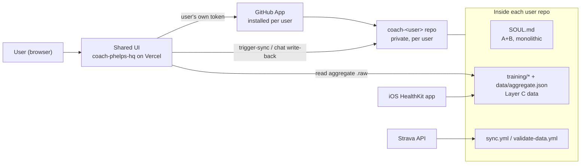
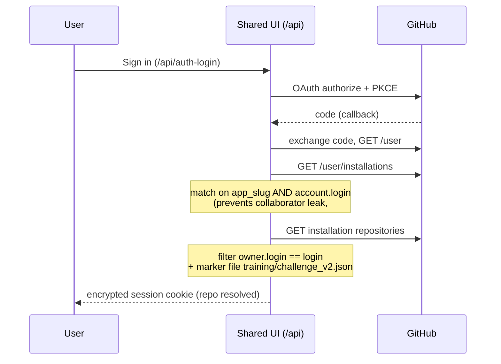
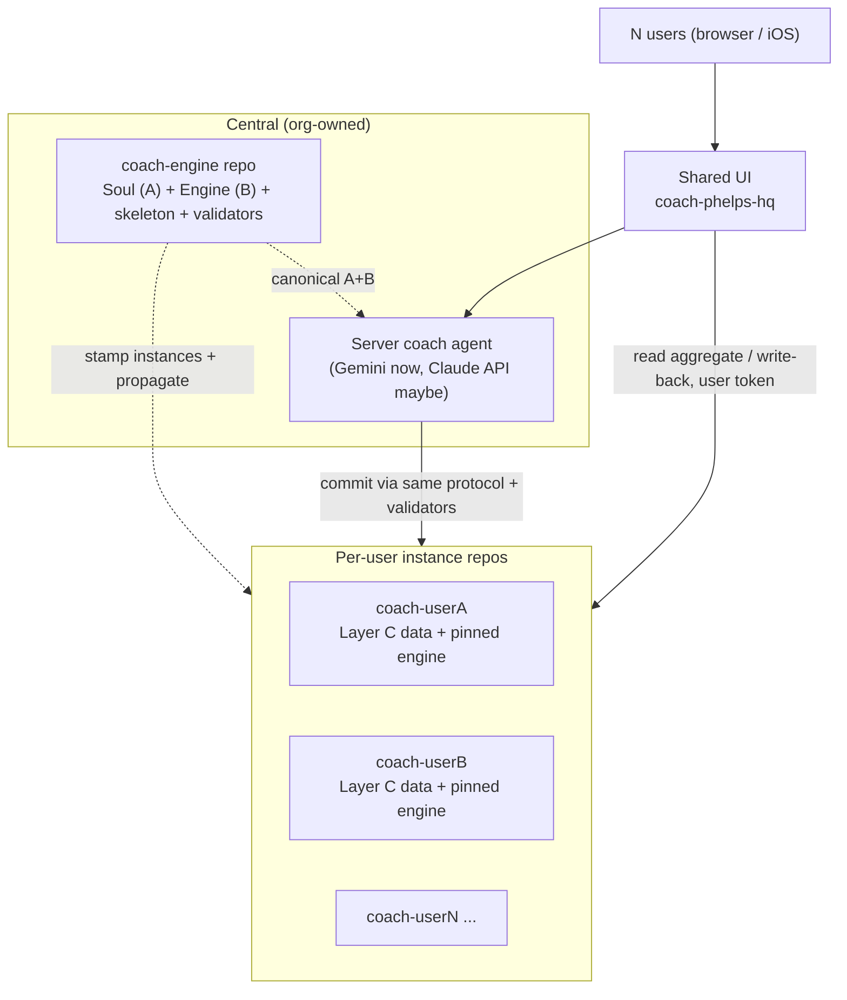
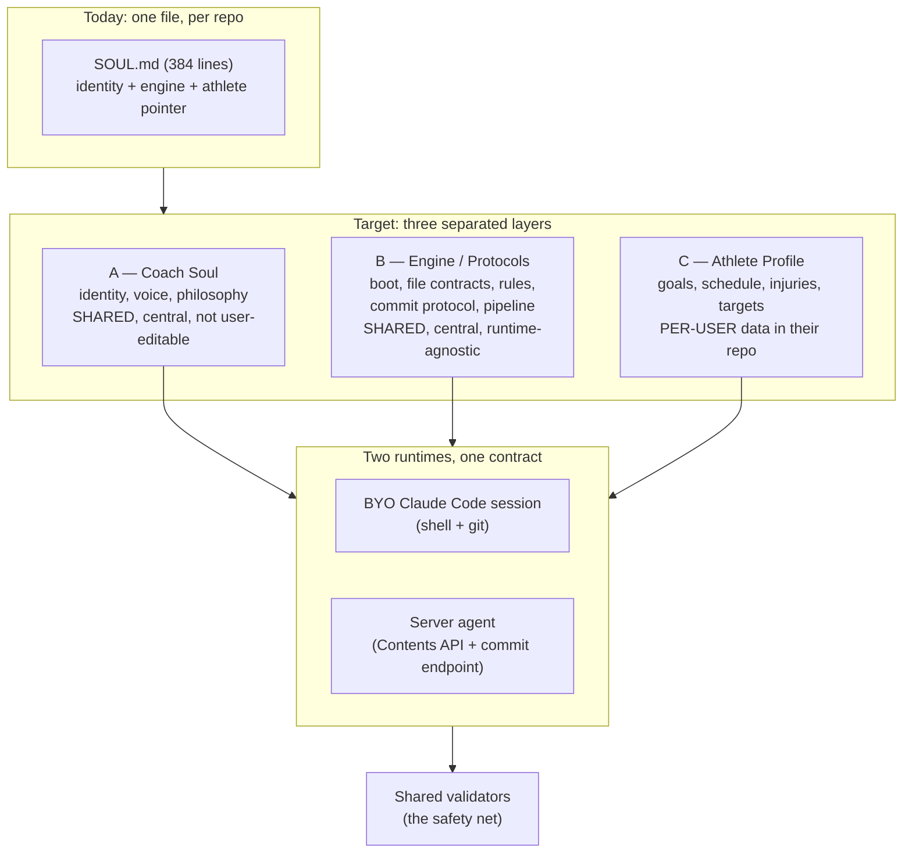
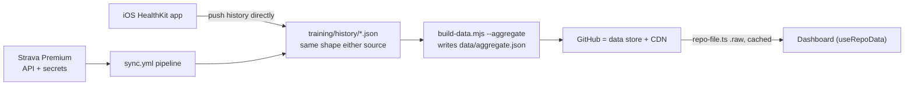
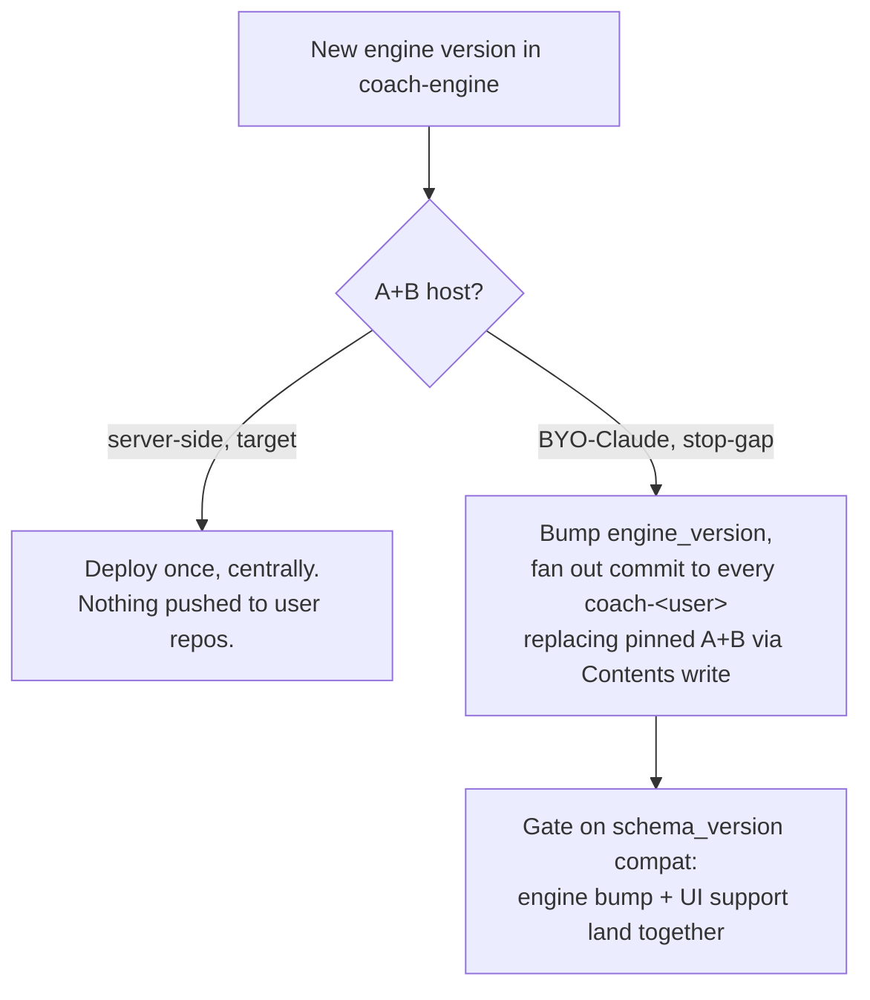

# Scaling Plan — Coach Phelps → Multi-Tenant

Design baseline for moving Coach Phelps from single-tenant (one hand-built repo per person) to ~10 users
on a shared hosted UI. Records what exists, where we're going, and how the pieces fit. Supersedes the
root `/scaling_plan.md`, which predates the current decisions and is folded in here.

---

## 1. Context

Coach Phelps started as one person's repo: a `SOUL.md` coaching persona, Strava/HealthKit data, a sync
pipeline, and a dashboard, all in a single repo that a Claude Code session drives. It works for one
athlete. We now want ~10 friends-and-family users on **one shared website**, each with their own private
data, without turning it into a social product.

The hard parts aren't the dashboard — they're identity (whose data am I looking at?), access (how does
the site read and write the right person's repo, and only theirs?), and the coach itself (one shared
Phelps, but per-user data, runnable both as a local Claude session and as a server agent). Much of the
identity/access layer is already built; the coach-as-a-service layer is half-built and is where the
real design work remains.

**Non-goal, permanently:** any social / cross-user feature. This is an individual coaching app. The
per-repo install model (below) enforces it structurally — leave no seam for it.

---

## 2. Current State

### 2.1 What's built

The identity, access, and data-loading layer in `coach-phelps-hq` is **done and hardened**. A
server-side Gemini coach that reads context and commits back also **already ships**.

| Capability | State | Where |
|---|---|---|
| GitHub App auth (user-to-server OAuth + PKCE) | Done, hardened | `ui/api/auth-*.ts`, `_lib/*` |
| User → repo resolution (ownership-filtered) | Done | `ui/api/list-my-repos.ts` |
| Runtime data load ("repo-as-CDN") | Done | `ui/api/repo-file.ts`, `hooks/useRepoData.ts` |
| Sync trigger from UI | Done | `ui/api/trigger-sync.ts` |
| **Server coach (Gemini) + write-back at close** | **Built** | `ui/api/coach-chat.ts`, `pages/CoachChat.tsx` |
| Dual-path ingestion (Strava / iOS) | Working | `.github/workflows/sync.yml`, `scripts/` |
| Direct-to-main data validation | Basic (JSON-parse only) | `.github/workflows/validate-data.yml` |

Three facts the rest of the doc builds on:

- **Token model:** every GitHub read/write uses the *signed-in user's own* user-to-server token, scoped
  by the App install to exactly their one repo. No shared bot PAT. App permissions: **Contents R/W**,
  **Actions R/W**.
- **Stateless sessions:** an encrypted JWE cookie (jose / A256GCM / `SESSION_SECRET`, 8h TTL) carrying
  `login`, `gh_token`, `installation_id`, `repo_full_name`. No server database.
- **Layer C is already data:** athlete profile, injuries, plan, quests, sleep, notes live in
  `training/state.md`, `challenge_v2.json`, `coach_notes.md`, `sleep_log.json`, `roadmap.md` — not baked
  into `SOUL.md`. A real head start on the 3-way split.

### 2.2 How it fits together today



### 2.3 Login + repo resolution (current)



### 2.4 What's left (the gap)

- **No skeleton-based onboarding wired in.** Login/resolution assume the user already owns a repo with
  the marker file. A skeleton repo exists but isn't yet a documented clone-and-provision flow (#32).
- **`SOUL.md` is still one 384-line file, per repo.** All three layers entangled; no central versioning,
  no propagation.
- **The server coach is a *second, parallel* engine, not shared execution.** `coach-chat.ts` re-encodes
  Layer B in TypeScript + a system prompt that dumps the whole `SOUL.md` at Gemini — re-implementing the
  writable-file allowlist, close trigger, and commit protocol in the endpoint. A BYO-Claude session and
  the Gemini session now run *different copies* of the rules. That drift is the central risk (§7/§9).
- **Engine isn't runtime-agnostic.** Boot assumes filesystem + `git pull` + python + a Claude Code
  session. Validators only check JSON-parses, not the file contracts the engine depends on.
- **Stale docs:** root `README`/`SETUP`/`HOW_IT_WORKS` still describe the old self-host-your-own-Vercel
  flow.
- **Naming/legal:** "Coach Phelps" is a real, litigious public figure — persona rename required before
  any public launch (§8).

---

## 3. Goal State

One shared UI, N private per-user instance repos, one central coach whose engine executes identically
whether a human Claude session or a server agent runs it, with validators as the shared safety net.



Goal-state properties: users never edit A or B; each user's data is isolated in their own repo (no query
spans users); the engine is one artifact, executed by either runtime; and moving the coach from
BYO-Claude to fully server-side is a *hosting* change, not a rewrite.

---

## 4. Assumptions & Locked Decisions

Build on these; they're settled:

- **Topology:** 2 new repos (shared UI + a skeleton/template) + N private per-user instance repos
  generated from the skeleton.
- **Access:** a GitHub App installed per user, granting full read + write + Actions on that *one* repo.
- **One shared coach (Phelps)** for everyone; persona versioned centrally, not per-user editable.
- **Fresh skeleton:** the original repo gets archived; coach + protocols redesigned from scratch.
- **SOUL is three layers** (A Soul / B Engine / C Athlete data), all separated; B is runtime-agnostic so
  a human Claude session or a server agent execute it identically, with validators as the safety net.
- **Athlete is data, not identity:** the coach reads the athlete; he does not embody one person.
- **Ingestion is dual-path, user picks one:** Strava Premium (API) or the iOS app (HealthKit → GitHub).
  Both land the same history shape downstream.
- **No social / cross-user features, ever.**

**Deliberately deferred** (flagged, not decided here):

- **Where A+B physically live at target** — gated on whether server-side coaching (Gemini, maybe a
  metered Claude API) proves worth it. **BYO-Claude is an explicit stop-gap** for F&F testing, not the
  end state. Only the server-side variant gives a real IP boundary.
- **Auto-provisioning.** MVP onboarding is **operator-run**: we hold the skeleton and clone + set it up
  per user by hand. Self-serve provisioning (needs Administration + Secrets App permissions) is a later
  phase.

---

## 5. High-Level Design

### 5.1 Repo topology

| Repo | Visibility | Contains | Written by |
|---|---|---|---|
| `coach-phelps-hq` (UI) | Public/org | Shared dashboard + `ui/api/*` auth/data/chat layer. The only UI any user touches. No per-user data. | Engineering (PR) |
| `coach-engine` (skeleton/canonical) | Private, org | Canonical Soul (A) + Engine (B), skeleton file tree, workflows, pipeline, validators. Source of truth for new instances and propagation. | Engineering (PR) |
| `coach-<user>` (instance) | Private, per user | Layer C data + synced history + pinned engine version. One per user. | Coach (data commits) + sync pipeline |

`ui/` never ships into instance repos — the shared site is the only UI. The per-repo App install is what
makes cross-user data access structurally impossible.

### 5.2 The 3-way SOUL split



Mapping from today's file: A = §3 Identity + §4 Philosophy + §5 Seasons; B = §1 Boot, §10 Rules, §11
Workflows, §12 Tools/Data, §13 Commit; C = §7 The Athlete → already `training/state.md`. The redesign's
job is to (a) strip every athlete-specific detail out of A/B, (b) turn §7/§8 into a schema + generic
first-session intake that *populates* C for whoever is new, and (c) rewrite B as capability contracts so
either runtime can execute it — with validators enforcing the guarantees regardless of who ran the
session.

### 5.3 Data flow: dual-path ingestion → repo-as-CDN



The aggregate is the contract between pipeline and UI: one file, one fetch, `schema_version`-gated. Both
ingestion sources are interchangeable because everything downstream reads `training/history/*.json`
identically. This "repo-as-CDN" model holds comfortably at ~10 users; it's the piece §10 eventually
outgrows.

---

## 6. Low-Level Design

### 6.1 Auth / access (built — don't regress)

Two hardening details are load-bearing and must survive any refactor:

1. **Installation resolution matches on `app_slug` AND `account.login`.** `GET /user/installations`
   returns installs the caller can merely *see* (via collaboration), so app-only matching once resolved a
   collaborator to the owner's install — a real cross-account leak (#30).
2. **Repo candidates are filtered to `owner.login === session.login`.** The install picker lists repos the
   user has admin on, including collaborator repos on other accounts; ownership, not access, is the gate
   (`list-my-repos.ts`), before the marker-file check.

Access per install: Contents R/W (data write-back) + Actions R/W (sync dispatch), scoped to the one repo.
Sessions are stateless — trade-off: multi-repo owners re-pick every ~8h; fixable later with a separate
long-lived "last-picked-repo" cookie.

**Deferred permissions** (bundle into one re-consent): **Administration** (API-create an instance repo)
and **Secrets** (write Strava secrets on the user's behalf; needs client-side libsodium encryption).

### 6.2 Server coach write-back (`coach-chat.ts`) — built

```mermaid
sequenceDiagram
  participant U as User
  participant API as coach-chat.ts
  participant GH as GitHub (user token)
  participant G as Gemini
  U->>API: POST message + running thread
  API->>GH: read SOUL.md + state.md + quest_log.md
  API->>G: system=SOUL dump + context, contents=history
  G-->>API: reply (+ optional file_updates, commit_message)
  alt ordinary turn
    API-->>U: reply only (no repo write; client holds thread)
  else close signal (wrap / close / end session)
    Note over API: filter file_updates to writable allowlist<br/>state.md, coach_notes.md, challenge_v2.json,<br/>sleep_log.json, sessions/*
    API->>GH: PUT each file + chat_history.json (commit to main)
    API-->>U: reply + closed=true
  end
```

Key mechanics: no server DB — the repo is the only durable store; nothing is written mid-conversation
(unwrapped chat lost on refresh, accepted); commit happens once at a deterministic keyword close-trigger;
the writable-file allowlist is defense-in-depth against whatever the model proposes; a single shared
`GEMINI_API_KEY` (free tier, 429-handled) serves all users.

**The problem it exposes:** this endpoint is a *second implementation* of Layer B. Every rule that lives
only in its prompt (verbatim file reproduction, close trigger, allowlist) is a rule the BYO-Claude
runtime enforces differently or not at all. Collapsing these into one shared B + one shared validator is
the core P2 work (§7). Until then, Gemini reproducing a 14KB `state.md` verbatim is one truncation from
corrupting data, with only a JSON-parse check guarding it.

### 6.3 Skeleton, onboarding, propagation

**Onboarding — operator-run (MVP).** Ideally scripted as `scripts/provision-user.sh <gh-user> <name>`:
create private `coach-<user>` from `coach-engine`; set the sync source (write Strava secrets, or mark
iOS-mode); seed empty Layer C so the marker exists; user installs the App via "Sign up with GitHub",
signs in, and runs first-session intake to populate C. Automating repo-create + secrets is the later
phase behind the Administration/Secrets permissions.

**Engine-update propagation** depends on the deferred A+B host:



Server-side makes propagation free (one deploy). The BYO-Claude stop-gap requires pushing A+B to N repos;
because these are engine files (not athlete data) it's a clean overwrite, but it must be gated on the
`schema_version` contract so a fan-out can't strand users on "repo needs updating." Either way, users
receive A+B, never author them.

### 6.4 Validators as the shared safety net

Extend `validate-data.yml` from JSON-parse-only to the **full file contracts** (required `state.md`
sections, `challenge_v2.json` schema, sleep-log pairing, session-file shape). This is what makes "either
runtime, executed identically" true rather than aspirational: a server-written commit and a human-written
commit pass the exact same gate. This is the highest-priority hardening item because write-back is
already live.

---

## 7. Phased Roadmap

| Phase | Goal | Key work |
|---|---|---|
| **P0 — Split & make B runtime-agnostic** | An engine a server *could* run | Break `SOUL.md` into A / B / C; rewrite B as capability contracts; extend `validate-data.yml` to full file contracts; freeze the aggregate `schema_version` contract. |
| **P1 — Skeleton + operator onboarding** | New F&F user in <30 min, BYO-Claude | Stand up `coach-engine`; `provision-user.sh`; pinned A+B stamped into instances; propagation fan-out action; rewrite README/SETUP for the hosted flow; archive the original repo. |
| **P2 — Unify the two engine implementations** | One shared B, two hosts, no drift | *Gemini chat + write-back already ships (`coach-chat.ts`).* Remaining: collapse the endpoint's re-encoded rules into shared Layer B; make the extended validator (P0) the single safety net both hosts pass through; evaluate reading A+B from a central source instead of per-repo `SOUL.md`; assess whether A+B can go server-only. |
| **P3 — Decide the engine host** | Resolve the deferred fork | Based on P2 feedback: keep BYO-Claude, go server-side-only (IP boundary + central propagation), or hybrid. Update §4/§6. |
| **P4 — Self-serve provisioning** | Drop the operator step | Request Administration + Secrets permissions (one re-consent); auto-create repo + write secrets on first login; guided sync-source setup. |
| **Later** | Scale + product vision | See §10. |

Ordering rationale: P0 unlocks everything (a runtime-agnostic engine + real validators is what makes both
hosts safe). P1 gets real users on the stop-gap and gathers the feedback P2/P3 depend on. Provisioning
automation (P4) is deliberately last — UX polish over a manual step that already works.

---

## 8. Risks & Open Questions

**Persona naming / legal — blocks public launch.** "Coach Phelps" is an unmistakable reference to a real,
still-active, brand-litigious public figure (right of publicity; Lanham Act false-endorsement). Zero
exposure while private among F&F; a real risk the moment anything is public/shareable. Rename the persona
(not the concept) with runway. Org is already `sibling-shipyard`; the repo name and in-product persona are
still pending.

**The IP-boundary fork is unresolved by design.** Local BYO-Claude and "don't let users see the engine"
are mutually exclusive. Resolved only by going server-side (P2/P3). Until then, accept F&F can read the
engine.

**Server execution must match human execution exactly — and this is now live.** `coach-chat.ts` already
writes to repos through a re-encoded copy of B, so the divergence risk is real today, not future. The
validator-as-safety-net (§6.4) must be extended to the full file contracts and made the shared gate both
hosts pass through — the highest-priority hardening item.

**Shared Gemini key = shared cost + rate limit.** One server `GEMINI_API_KEY` on the free tier serves all
users (429s handled, not avoided). Fine at F&F scale; a real ceiling as users grow; feeds the funding
question below.

**Propagation half-apply.** A fan-out that bumps `schema_version` without matching UI support strands
users on "repo needs updating." Gate on the compat note (§6.3); prefer additive schema changes.

**Data-store scale ceiling.** Repo-as-CDN is fine at 10 users; unbounded history + Contents API limits are
the eventual pressure that forces §10. Watch aggregate size and rate-limit headers.

**Open questions for later:** (a) does collaborator access ever grant dashboard viewing — recommend
explicit owner opt-in only, never inherited from repo collaboration; (b) per-user page configurability
(#13); (c) Android / non-iOS sync sources; (d) funding path for centralized model cost if server-side
wins (metered Claude API vs. Gemini free tier vs. per-user BYO).

---

## 9. Long-Term Vision (rough — recorded, not designed)

Not committed; captured so the architecture above doesn't paint us into a corner.

- **Scale to ~10k users.** Repo-as-CDN won't hold — expect a real backend (Postgres + object store for
  history) fronting the same aggregate contract, with GitHub demoted to an optional sync target rather
  than the store. The `schema_version`/aggregate contract is what makes that swap survivable.
- **UI: web + iOS**, narrative dashboards, unique insights, configurable widgets. Per-user widget/page
  config (#13) is the first concrete step and should be stored in Layer C.
- **iOS app**: Apple Watch companion, lock-screen tracking, auto-sync on new activity — the iOS ingestion
  path maturing into the primary sync source.
- **Talk to coach through the UI** — first slice already shipped (`coach-chat.ts`).
- **Ultimate:** the coach watches for sync + pre-reads new activity and drops a comment for the UI to
  surface. Architecturally this is a server agent executing Engine (B) on a sync webhook, writing a
  `coach_comment` into Layer C / the aggregate — exactly why B must be runtime-agnostic and
  server-executable (§5.2). Everything in P0–P3 is on the path to this.

---

## Appendix — canonical file / endpoint references

- Auth: `ui/api/auth-login.ts`, `auth-install.ts`, `auth-callback.ts`, `auth-me.ts`, `auth-logout.ts`,
  `ui/api/_lib/session.ts`, `_lib/pkce.ts`
- Repo resolution: `ui/api/list-my-repos.ts`
- Runtime data: `ui/api/repo-file.ts`, `ui/client/src/hooks/useRepoData.ts`, `components/RepoDataGate.tsx`
- Sync trigger: `ui/api/trigger-sync.ts`
- Server coach + write-back: `ui/api/coach-chat.ts`, `ui/client/src/pages/CoachChat.tsx`
- Data build: `ui/scripts/build-data.mjs` (`--aggregate`)
- Workflows: `.github/workflows/sync.yml`, `apply-coach-patch.yml`, `validate-data.yml`
- Engine (current, to split): `SOUL.md` (§1 boot, §7 athlete, §10 rules, §11 workflows, §13 commit)
- Prior context: `docs/website-unification-history.md`, `/scaling_plan.md` (superseded)
